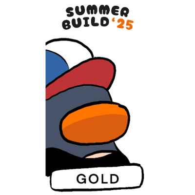

This is a [Next.js](https://nextjs.org) project bootstrapped with [`create-next-app`](https://nextjs.org/docs/app/api-reference/cli/create-next-app) for the SummerBuild 2025 hackathon hosted by DevHub@iLab, innovation lab @ NTU CCDS

## Getting Started

First, run the development server:

```bash
npm run dev
# or
yarn dev
# or
pnpm dev
# or
bun dev
```

Open [http://localhost:3000](http://localhost:3000) with your browser to see the result.


### StudySpark

The purpose of this app is to help students study efficiently by recommending topics that need more attention, avoiding time spent on topics they already know well.

The app tracks two metrics for each topic: Level of Confidence (LoC) — Low, Medium, or High — and the date of the latest study session. Together, these determine a proficiency score for each topic.

After each study session, students log how well it went and the date. If a topic isn’t studied for a while, its score decreases. The decay rate depends on how many times the topic has been studied: after 3, 7, and 11 days for the first, second, and third+ sessions, respectively. This encourages spaced repetition — a proven effective study technique.

Based on the scores, the app recommends the top 3 topics needing review. This removes the guesswork in choosing what to study next, helping students stay focused and efficient without stressing out about how to go about with their studying.

This app is built using Next.js, leveraging on its file-based routing and React components for better code structure. I used LocalStorage for data persistence due to limited backend experience xD. A daily motivational quote (which ended up not really being motivational but the idea is there) is also provided via the ZenQuotes API.

Level Of Achievement (Gold) badge (Basic CRUD + API integration):

(Click on image to verify)

[](https://badgr.com/public/assertions/YFJa-Z-AQW-RG_6kfaZVgg?identity__email=JASP0016%40e.ntu.edu.sg)


